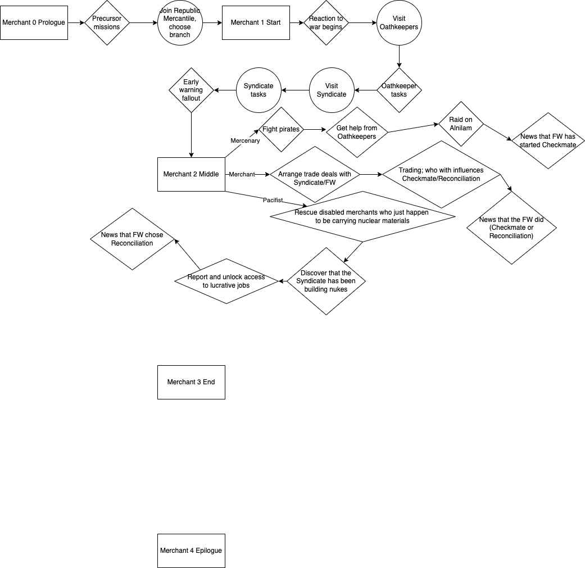

~~Navy~~ Merchant campaign when

# Initial Pitch (with notes)

Three branches: Pacifist (low combat rating, done missions like Adelita 5 or FW Katya 3), Mercenary (high rating, low bounty reputation), Merchant (high cargo attractiveness).

You then explicitly tell someone in a bar, twice, that you intend to be neutral. This is important because it means that if you actually do want to do free worlds, you won’t be time limited.
(E.d: This may end up just be a contract that you sign stating that you will not choose a side as a precondition for joining Republic Mercantile)

During the campaign, you are doing one of three things:

Pacifist: Humanitarian missions, bringing people and reporters across borders. You are hired to deal with the fallout of the Alphas. You eventually find a disabled ship and discover that it has evidence of Syndicate involvement in the war. (This is more complicated than it sounds as you don’t know if telling the Free Worlds will just lead to more war)

Mercenary: Fighting pirates and occasionally Republic, Syndicate, Free Worlds targets (this includes the option of fighting the Syndicate defector or the fleet chasing them). You are hired to fight the Alphas.

Merchant: Taking advantage of the war to ship cargo from one side to the other at a markup. In this case checkmate or reconciliation is random, determining whether you ship between Syndicate/Free Worlds or Republic/Free Worlds. You are hired to supply weapons to the group fighting the Alphas.
(E.d: At the beginning this may be more generic shipping missions or arranging trade deals rather than immediately jumping to exploiting the war for profit. The last sentence refers to the Alphas that were in Poisonwood, not the Syndicate Alphas.)

The Pug invasion: The Pug invade at the same time in all three cases. You happen to be within Pug space when this happens. As a mercenary, you are given no payment to fight the Pug, but told you can loot a jump drive from them, so that becomes your payment. As a merchant, you purchase jump drives looted from the Pug to sell to the Navy, Free Worlds, etc. but “accidentally” keep one yourself. The pacifist route is a little different: you help the Pug cut the hyperlanes in exchange for a jump drive. Then you “fight” the Pug along with everyone else.

# Flowchart (WIP)

[] means a specific file

<> means each branch has its own task

() means every branch has the same task

## Instructions for editing the flowchart
There are two files: Flowchart.png (for viewing) and Flowchart.drawio (for editing)

In diagrams.net, click github, then open existing diagram, then authorize, then go to ziproot/merchant-campaign and your branch (this branch is flowchart specific), and you should be able to edit the flowchart from there. If it doesn’t show up, then I can try a different approach.

To save, you must both click save to save the data for draw.io, then click File-->Export as-->Png-->Export, change the name to Flowchart.png, then click Save to save the data as an image.

# Miscellaneous info

* New China has been renamed to Kunlun
* Republic Mercantile will be located in Kunlun in the Merak system
* Republic Mercantile plays a big role in Kunlun’s economy and may have even been subcontracted by Parliament to help keep the terraforming system afloat, though they were not given nearly enough funds for the task.
* The description of Kunlun has been updated to mention Republic Mercantile from the start of the game
* There will be a few jobs that you do that are more lucrative than normal to lure players to Kunlun
  * I made wholesale shipping jobs and plan to also make Martini relief jobs during the one month evacuation period
  * bene-dictator plans to make medical supply jobs
  * Jarl Dane is working on (timed?) delivery jobs where their freighter was disabled, so you need to make the delivery yourself
  * mOctave made bounty hunter jobs
  * TheGiraffe3 made smuggling and merchant rescue jobs
* Alternatively, you will be automatically asked if you want to join if you decline Free Worlds (and eventually also Navy, Syndicate, Pirate)
* Once you do this, you have to sign a contract stating you will not choose a side, at which point you join Republic Mercantile (and set chosen sides)
  * This unlocks higher paying jobs and starts the campaign
  * You will be asked to choose a branch immediately, and will be recommended one based on factors like combat rating, Republic Mercantile jobs, reputation with various factions, or other missions you have done, but you can choose any branch
* Each branch will have its own character, plus one character that you talk to in the beginning prior to choosing a branch.
* We have not decided on rewards for beating the campaign yet, but this can probably wait until later.
* We have also not decided on a salary and/or dues and any perks you get immediately besides better job board missions
